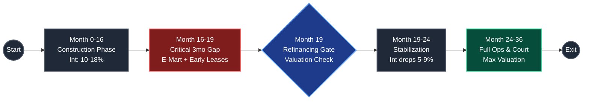
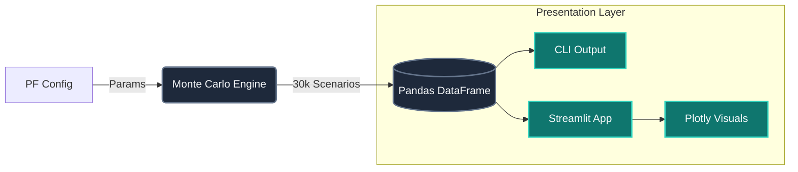

# Liquidity Risk in Highly Leveraged Real Estate PF

## Stochastic Cash Flow Modeling & Monte Carlo Risk Analysis

[](https://cookiecutter-data-science.drivendata.org/)
[](https://pf-liquidity-risk.streamlit.app/)
[](https://opensource.org/licenses/MIT)

Monte Carlo simulation framework for quantifying liquidity risk in highly leveraged commercial real estate development projects. Analyzes default probability, refinancing viability, and equity IRR distributions through 30,000+ stochastic scenarios.

> **🚀 [Try the Live Demo](https://pf-liquidity-risk.streamlit.app/)** - Interactive dashboard with real-time parameter adjustment

---

## 🚀 Quick Start

### Option 1: Live Demo (Fastest)

**👉 [Launch Dashboard](https://pf-liquidity-risk.streamlit.app/)**

Run simulations instantly in your browser with:

- Real-time parameter adjustment
- Interactive visualizations
- Bilingual interface (EN/KO)
- Scenario comparison
- CSV export

### Option 2: Local Installation

```bash
git clone https://github.com/aestim/real-estate-pf-liquidity-risk.git
cd pf-liquidity-risk
python -m venv venv
source venv/bin/activate  # Windows: venv\Scripts\activate
pip install -r requirements.txt
```

### Run Simulation

```bash
# CLI version
python pf_liquidity_risk/modeling/train.py

# Interactive dashboard
streamlit run pf_liquidity_risk/app.py
```

---

## 📌 Executive Summary

| Item | Details |
| :--- | :--- |
| **Project** | Commercial parking tower (adjacent to District Court) |
| **Leverage** | **77.2% LTV** (3.39x Leverage) |
| **Anchor** | **E-Mart Everyday** (1st floor, fee-based lease) |
| **Core Risk** | **Refinancing Gap:** Critical liquidity burn between Month 16-19 |

> [!CAUTION]
> **The 3-Month Death Valley:** PF interest (~220M KRW/mo) at 14% far exceeds early-stage NOI, leading to rapid equity erosion before the Month 19 refinancing gate.

---

## 🎯 Core Problem: The 3-Month Refinancing Window

### Project Timeline



### The Challenge

| Phase | Timeline | Revenue | Interest | Risk |
| :--- | :--- | :--- | :--- | :--- |
| **Construction** | 0-16m | Zero | 10-18% (100% capitalized) | Construction delays |
| **Critical Window** | 16-19m | Starting | 10-18% (40% capitalized) | **Highest equity burn** |
| **Refinancing Gate** | Month 19 | - | Rate reset | Refinancing failure risk |
| **Stabilization** | 19-24m | Ramp-up | 5-9% (0% capitalized) | Market risk |
| **Post-Opening** | 24-36m | Stabilized | 5-9% (0% capitalized) | Sustained operations |

**Month 16-19 (Critical 3-Month Window):**

- Building just completed - Revenue is anchored by E-Mart Everyday and supplemented by initial early-moving tenants.
- Still paying construction-phase rates (10-18% p.a.) on the massive 19B KRW debt.
- **The structural flaw:** While the E-Mart anchor significantly accelerates overall lease-up, the combined initial NOI during this 3-month fit-out/rent-free period is still mathematically insufficient to cover the compounding debt service and hit the demanding LTV threshold, leading to equity erosion.

**Month 19 (Refinancing Gate):**

- Property value = (3-month trailing NOI × 12) / 5.5% cap rate
- Bank requirement: Current Debt ≤ Property Value × LTV (70-85%)
- **Success:** Interest drops to 5-9%, debt service manageable → survival likely
- **Failure:** Cannot refinance, rates stay at 10-18% → default likely within 3-6 months

**Month 24 (Court Opening):**

- District court opens → primary demand driver activates
- Revenue stabilizes at 80-100% capacity
- No longer a critical gate (already refinanced at Month 19)

---

## 📊 Key Results

### Project Risk Summary (30,000 simulations)

| Outcome | Probability | Timing | Root Cause & Description |
| :--- | :---: | :---: | :--- |
| **Refinancing Failure** | **92.8%** | Month 19 | **Critical Bottleneck:** E-Mart NOI alone is insufficient to meet the 19B KRW LTV gate |
| **Successful Exit** | **7.2%** | Month 36 | **Best Case:** Requires exceptional early lease-up of upper floors to offset debt |
| **Default** | **0.0%** | Month 16-19 | **Downside Protected:** E-Mart baseline revenue effectively neutralizes immediate insolvency |

### Risk Metrics

- **Expected Shortfall:** ~5.7B KRW (Average capital injection required upon refi failure)
- **95% VaR:** 100.0% of initial equity (Full loss potential in refi failure scenarios)
- **Median IRR (exits):** 50.0% annualized (High-risk, high-reward profile)

---

## 🔧 Interactive Dashboard Features

- **Real-time parameter adjustment**
  - Capital structure (equity, debt, fixed costs)
  - Revenue distributions (stabilization & post-opening phases)
  - Interest rate scenarios (pre/post refinancing)
  - Project timeline (completion, refinancing, court opening, exit)

- **Dynamic visualizations**
  - Outcome probability distribution
  - IRR histogram with percentiles
  - Month-by-month survival curve
  - Exit multiple analysis

- **Scenario comparison**
  - Save baseline scenarios
  - Compare deltas across runs
  - Track changes in key metrics

- **Bilingual interface** - English/Korean toggle

- **Export capabilities** - Download CSV results, save high-resolution charts

---

## 🛠️ Technical Stack

### Architecture



### Core Components

- **Simulation Engine:** `PFInvestmentModel` - Monthly cash flow paths with stochastic variables
- **Configuration:** `PFConfig` - Dataclass with triangular distributions for all parameters
- **Visualization:** Plotly interactive charts + Matplotlib static reports
- **Caching:** Streamlit @cache_data for instant re-runs with same parameters

### Stochastic Variables (Triangular Distributions)

| Variable | Min | Mode | Max | Applied Phase |
| :--- | :---: | :---: | :---: | :--- |
| Interest Rate | 10% | 14% | 18% | Pre-Refinancing (0-19m) |
| Interest Rate | 5% | 7% | 9% | Post-Refinancing (19-36m) |
| Monthly Revenue | 8.9 | 21.4 | 26.8 | Stabilization (indexed) |
| Monthly Revenue | 21.4 | 35.7 | 44.6 | Post-Opening (indexed) |
| Construction Delay | 0mo | 2mo | 6mo | One-time shock |
| Refinancing LTV | 70% | 80% | 85% | Month 19 gate |

---

## 💼 Use Cases

### For Developers

- **Pre-Investment Due Diligence:** Quantify probability of surviving the 3-month window
- **Capital Structure Optimization:** Test different debt/equity mixes
- **Contingency Planning:** Size equity reserves for construction delays + refinancing gap

### For Lenders

- **Credit Risk Assessment:** Evaluate refinancing failure probability
- **Covenant Structuring:** Set appropriate LTV thresholds for Month 19 gate
- **Portfolio Risk Management:** Stress test exposure across multiple PF loans

### For Investors

- **Risk-Adjusted Return Analysis:** Compare IRR distributions across deals
- **Liquidity Risk Quantification:** Understand 3-month window vulnerability
- **Exit Strategy Planning:** Identify optimal hold periods given refinancing risk

---

## 📈 Strategic Recommendations

### Pre-Construction

1. **Equity buffer:** Increase 30-40% above base case to absorb 3-month negative carry
2. **Rate hedging:** Fix construction rate ≤12% to reduce downside exposure
3. **Accelerated construction:** Reduce completion time 16→14 months to shorten high-rate period

### Critical Window (Month 16-19) - HIGHEST PRIORITY

1. **Leverage Anchor LOC:** Use the signed E-Mart Letter of Commitment (LOC) to negotiate "Forward-looking NOI" valuations with lenders, bypassing the standard requirement for 3 months of historical trailing NOI.
2. **Aggressive lease-up:** Offer 2-3 months rent-free on upper floors to accelerate occupancy, strictly aligning with E-Mart's grand opening traffic.
3. **Operating reserves:** Pre-fund 3 months of debt service shortfall using the remaining equity buffer.

### Refinancing (Month 19)

1. **Forward-Valuation Push:** Refuse traditional trailing-average appraisals. Force lenders to value the asset based on "In-Place NOI" secured by the corporate anchor.
2. **Conservative LTV target:** Aim for 70% (not 80-85%) to ensure approval even under stressed cap rate assumptions.
3. **Alternative lenders:** Line up backup refinancing sources that specifically favor corporate-backed lease agreements.

### Post-Refinancing (Month 19-36)

1. **Debt paydown:** Use excess cash flow to reduce principal aggressively
2. **Court opening coordination:** Monitor district court construction timeline
3. **Exit timing:** Optimize sale timing for maximum stabilized NOI multiple

---

## ⚠️ Limitations & Assumptions

### Model Assumptions

1. **Interest rates independent across phases** - No correlation between pre/post refi rates
2. **Revenue distributions static** - Does not account for market cyclicality
3. **No explicit macroeconomic scenarios** - Recession, rate shocks not modeled
4. **Single-asset analysis** - Portfolio diversification effects not considered
5. **Fixed refinancing timing** - Month 19 not optimized dynamically
6. **Deterministic court opening** - Month 24 assumed certain (not stochastic)

### Data Requirements

- Accurate construction timeline estimates
- Reliable market rent/occupancy data for 3-month ramp-up
- Lender refinancing appetite (LTV assumptions)
- District court construction schedule certainty

### Not Suitable For

- ❌ Early-stage land banking projects
- ❌ Multi-phase developments with complex waterfall structures
- ❌ International projects with FX risk
- ❌ Projects with significant regulatory uncertainty
- ❌ Residential projects with different absorption patterns

---

## 📁 Project Structure

```text
├── pf_liquidity_risk/
│   ├── modeling/
│   │   ├── config_model.py    # PFConfig dataclass
│   │   └── train.py            # Monte Carlo engine
│   ├── configs/
│   │   ├── public_config.py    # Normalized params (committed)
│   │   └── private_config.py   # Real params (gitignored)
│   └── app.py                  # Streamlit dashboard
├── reports/figures/            # Output visualizations
├── requirements.txt
└── README.md
```

---

## ❓ FAQ & Strategic Insights

This section details the financial assumptions behind the **3-month "Death Valley"** and the **Month 19 Refinancing Gate**.

<details>
<summary><b>Q: Why is there a 3-month gap between completion and refinancing?</b></summary>

* **Bank Underwriting:** Refinancing lenders (Facility Loans) require a **"Trailing NOI"** (Net Operating Income) to verify the asset's cash-flow stability before committing capital.
* **Operational Runway:** It takes a minimum of 3 months to complete tenant fit-outs, clear rent-free periods, and document actual rent deposits in bank statements.
* **💡 Strategic Insight:** This 3-month window is the project's most vulnerable phase, where high construction interest (10-18% p.a.) aggressively erodes equity before stabilization.
</details>

<details>
<summary><b>Q: Why can't we refinance at Month 16 (Day 1 of Completion)?</b></summary>

* **Vacancy Risk:** Without operating history, banks view the building as an "empty shell," significantly slashing the LTV (Loan-to-Value) ratio based on liquidation value rather than income value.
* **The "E-Mart" Cheat Code:** By securing **E-Mart Everyday** as a blue-chip anchor tenant, we can negotiate with lenders to recognize **"Forward-looking NOI"** based on signed lease agreements, potentially shortening this window.
* **💡 Strategy:** The model tests whether this "Anchor-Tenant Strategy" provides enough leverage to bypass traditional 3-month trailing requirements.
</details>

<details>
<summary><b>Q: What if the 3-month NOI is weak but improving?</b></summary>

* **The "Average Trap":** Lenders typically use a **simple 3-month trailing average**. 
* **Valuation Impact:** Zero-revenue months (due to rent-free periods or fit-outs) at the start of the window can "drag down" the entire valuation, causing an **LTV breach** even if Month 19's performance is strong.
* **💡 Risk Management:** This underscores why relying solely on historical NOI is fatal for highly leveraged PF projects.
</details>

<details>
<summary><b>Q: What happens if refinancing is delayed beyond Month 19?</b></summary>

* **Maturity Extension:** While lenders may grant an extension to avoid immediate default (EOD), the cost is catastrophic.
* **Financial Bleeding:** The project remains stuck with **10-18% p.a. construction rates**.
* **💡 Warning:** This is a survival tactic, not a strategy. At this stage, approximately **0.22B KRW** in cash is "evaporated" monthly into interest payments, rapidly zeroing out the developer's equity.
</details>

<details>
<summary><b>Q: How does the District Court opening (Month 24) affect the Month 19 gate?</b></summary>

* **Timing Mismatch:** The District Court is the primary demand driver for high-rent legal offices, but it opens **5 months AFTER** the critical refinancing window.
* **Lenders' Bet:** Refinancing banks at Month 19 are essentially "betting" on the court's timely completion.
* **💡 Critical Path:** If the court construction is delayed, the probability of refinancing failure spikes, as upper-floor stabilization becomes speculative rather than certain.
</details>

---

## 🤝 Contributing

Contributions welcome! Priority areas:

- Correlation structures between interest rates and revenue
- Sensitivity analysis visualizations (tornado diagrams)
- Mezzanine debt waterfall logic
- Jupyter notebook tutorials
- Additional output formats (Excel reports)

---

## 📚 Citation

```bibtex
@software{kim2025pf_liquidity_risk,
  author = {Kim, Minsung},
  title = {PF Liquidity Risk: Monte Carlo Simulation Framework for Real Estate Project Finance},
  year = {2025},
  url = {https://github.com/yourusername/pf-liquidity-risk},
  note = {Stochastic analysis of refinancing risk in leveraged commercial real estate development}
}
```

---

## 📧 Contact

**Author:** Minsung Kim  
**Repository:** [github.com/yourusername/pf-liquidity-risk](https://github.com/yourusername/pf-liquidity-risk)  
**Issues:** [GitHub Issues](https://github.com/yourusername/pf-liquidity-risk/issues)

---

## 📄 License

MIT License - See [LICENSE](LICENSE) file for details

---

**Built with:** Python • NumPy • Pandas • Streamlit • Plotly

**Methodology:** Monte Carlo Simulation • Stochastic Modeling • Project Finance Risk Management
